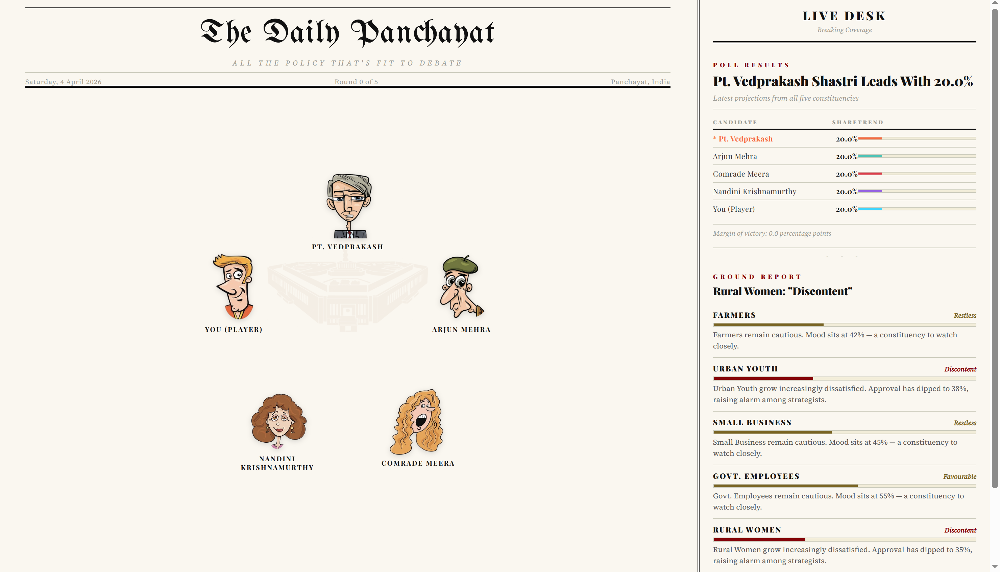
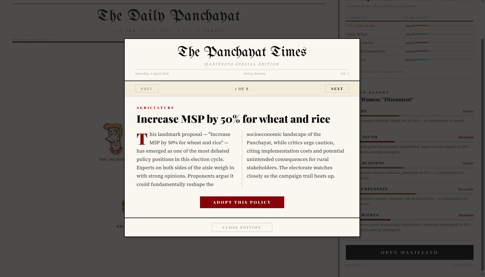

# Panchayat 

### Learn Democracy by Living It - An AI-Powered Political Simulation

**HackByte 4.0 | Claw & Shield Track (ArmorIQ x OpenClaw)**

---

## The Problem: Political Illiteracy in the World's Largest Democracy

India has **950 million** eligible voters, yet most citizens:

- Cannot name 3 policies from any party's manifesto
- Don't understand how elections are won or lost beyond caste/religion lines
- Have never experienced the strategic complexity behind policy-making
- Are unaware of election laws like the **Model Code of Conduct**, **RPA Section 125**, or **IPC Section 171**

**Panchayat AI** solves this by letting you *become* a politician. You don't read about democracy — you compete in it against 4 AI opponents who fight back, attack your record, and try to win the electorate. Every attack is validated by a real election code. Every vote you win or lose is earned through **policy, not propaganda**.

---

## What is Panchayat ?

A **turn-based political simulation** where you compete as an independent candidate against 4 AI-powered opponents in a Panchayat (village council) election. Over 5 rounds, you:

1. **Choose manifesto policies** from 50 real-world Indian policy proposals
2. **Watch AI candidates react** in-character with voice (ElevenLabs TTS)
3. **See attacks fly** between candidates - fact-based critiques, public challenges, scandal exposes
4. **Enter the War Room** to launch your own strategic attacks or test illegal moves
5. **Watch votes shift** in real-time as your decisions ripple through 5 voter demographics

The twist: **Every political action is validated by ArmorIQ Shield** - a cryptographic enforcement layer that blocks communal hate speech, personal attacks, fake claims, voter intimidation, and bribery. If an AI (or you) crosses the line, the Election Commission catches it.

<p align="center">
  
  <br/>
  
</p>

---

## Sponsor Track: Claw & Shield (ArmorIQ x OpenClaw)

### How We Implement Every Hackathon Requirement

| Hackathon Requirement | Our Implementation | Code Location |
|---|---|---|
| **Structured Intent Model** | `PoliticalIntent` class with candidate_id, action_type, target, narrative, SHA-256 intent hash | `bridge/shield_engine.py:67-103` |
| **Policy-based Runtime Enforcement** | 3-layer Shield: Type Check -> Content Regex -> ArmorIQ SDK verification | `bridge/shield_engine.py:216-283` |
| **Separation of Reasoning & Execution** | Claw (reasoning) generates intent -> Shield (execution gate) validates -> Game Engine mutates state | `bridge/claw_agent.py` -> `bridge/shield_engine.py` -> `bridge/api_server.py` |
| **At least 1 Allowed Action** | `policy_critique`, `public_challenge`, `voter_appeal` - all pass Shield | Verified in audit log |
| **At least 1 Blocked Action** | `communal_incitement`, `personal_attack`, `bribery_promise` — deterministically blocked | War Room "OUT OF CODE" attacks |
| **Logged & Explained Decisions** | Every Shield verdict logged to `data/shield_audit_log.json` with reason, policy ref, intent hash, timestamp | `bridge/shield_engine.py:336-368` |
| **No hardcoded shortcuts** | Real Gemini LLM reasoning for candidate reactions; regex + SDK for enforcement; structured JSON policy model | Full stack |

### Architecture: Election Commission as a Service

```text
PLAYER
  | (Picks manifesto -> Opens War Room -> Launches attack)
  v
CLAW (Reasoning Layer)
  | (AI Candidates autonomously generate political strategies)
  | Output: Structured PoliticalIntent JSON
  v
SHIELD (Enforcement Layer)
  | 1. Type Check -> 2. Content Regex -> 3. ArmorIQ SDK Crypto Verify
  | Output: ShieldVerdict (ALLOWED/BLOCKED)
  v
GAME ENGINE (State Mutation)
    (Only processes ALLOWED actions -> Updates forecast)
```

---

## Features

### 1. Manifesto System - 50 Real-World Indian Policies

Each round presents 10 policies from categories like agriculture, economy, technology, governance, defense, and culture. These are modeled on real Indian policy debates:

- *"Increase MSP by 50% for wheat, rice, and pulses"*
- *"Deploy free 5G connectivity for every village Panchayat"*
- *"Implement blockchain transparency for all Panchayat fund disbursals"*
- *"Mandate 50% women reservation in all Panchayat elections"*

Your choice shapes voter sentiment across 5 demographics with different ideological alignments.

### 2. AI Political Agents - 4 Distinct Ideologies

Each AI candidate is a fully-realized political persona powered by **Google Gemini**:

| Candidate | Party | Archetype | Key Trait |
|---|---|---|---|
| **Pt. Vedprakash Shastri** | Sanskriti Seva Dal | Traditionalist | Quotes the Arthashastra; cow-based economics |
| **Arjun Mehra** | Digital Bharat Front | Techno-Populist | IIT alumnus; campaigns on Instagram Reels |
| **Comrade Meera Devi Yadav** | Samta Shakti Morcha | Socialist Reformer | Led the 'Roti Andolan'; fights for daily-wage workers |
| **Nandini Krishnamurthy** | Swatantra Vikas Party | Corporate Libertarian | Former World Bank economist; 1991 reforms veteran |

Each AI reacts in-character to your policies with **ElevenLabs voice synthesis**, creating a living debate experience.

### 3. War Room - Strategic Political Combat

After each round, the **War Room** opens automatically. You:

- See **intelligence dossiers** on each opponent (vote share, threat level, past attacks)
- Choose from **5 legal attacks** per candidate based on manifesto weaknesses
- Can attempt **2 illegal attacks** per candidate (communal hate, personal attacks, bribery)
- Watch **ArmorIQ Shield** catch and block illegal moves in real-time
- See **vote distribution shift dynamically** based on your strategic choice

### 4. Cross-Candidate AI Attacks

AI candidates don't just target you - they **attack each other**. Each AI targets the current election leader with contextual, manifesto-specific critiques:

- *"Your Gau-Krishi scheme costs 500 crore with zero funding"* (vs. Dharma Rakshak)
- *"Your smart village contracts went to party donors"* (vs. Vikas Purush)
- *"Free everything sounds great. Who pays?"* (vs. Jan Neta)

These are drawn from a **168-attack database** (`bridge/warroom_db.py`) covering all candidate-vs-candidate matchups.

### 5. Shield Enforcement - India's Election Laws as Code

The Shield engine maps real Indian election law to AI policy enforcement:

| Violation Type | Legal Reference | Example Blocked |
|---|---|---|
| Communal Incitement | Section 125, RPA | *"Only Hindu values can save this Panchayat"* |
| Personal Attack | Model Code of Conduct | *"Your entire family is corrupt"* |
| Fabricated Claim | Section 171G, IPC | *"He is secretly plotting to sell village land"* |
| Voter Intimidation | Section 171C, IPC | *"If you don't vote for me, schemes will stop"* |
| Bribery Promise | Section 171B, IPC | *"Every family gets Rs 5000 for voting"* |

The engine uses **5 regex pattern engines** for content analysis and supports **ArmorIQ SDK** for cryptographic intent verification when configured.

### 6. Newspaper-Themed UI

The entire interface is designed as a **vintage Indian newspaper** ("The Daily Panchayat"):

- **Masthead** with date, round number, and edition line
- **Manifesto popup** as a multi-page newspaper slide
- **Speech bubbles** styled as editorial columns
- **Action Feed** as "Campaign Dispatches" with APPROVED/BLOCKED stamps
- **Election Forecast** as a newspaper bar chart
- **Voter Sentiment** panel with demographic breakdown

### 7. Unified Sequential Presentation

No chaos, no overlap. A **unified presentation queue** ensures:

1. Each candidate speaks one at a time with voice
2. Campaign attacks shown sequentially with audio
3. War Room opens only after all presentations complete
4. Current audio stops when you skip to the next item

### 8. ElevenLabs Voice Integration

Every AI response uses **ElevenLabs Multilingual v2** with candidate-specific voices:

- Male authoritative voice for Pt. Vedprakash
- Young tech-savvy voice for Arjun Mehra
- Female activist voice for Comrade Meera
- Professional consultant voice for Nandini

Attack narrations also play with TTS, creating an immersive debate experience.

### 9. Dynamic Vote Distribution

Votes shift based on:

- **Policy ideology alignment** - each voter group has different priorities
- **Attack impact modifiers** - scandal exposes hurt targets more than policy critiques
- **Per-candidate score boosts** - accumulated through the entire game
- **AI strategic advantage** - AI candidates have a 1.15x multiplier (seasoned politicians vs newcomer)

### 10. SpacetimeDB - Real-Time Vote Matrix

The election state is backed by a **SpacetimeDB** module that maintains a live **5x5 voter-candidate share matrix**:

- Each of the 5 voter demographics has a percentage allocated to each of the 5 candidates
- Every vote gained by one candidate is a **zero-sum loss** from others
- The `spacetime_client.py` bridge syncs AI actions and player attacks to this matrix in real-time
- Enables instant state consistency across all connected sessions via WebSocket subscriptions

### 11. Complete Audit Trail

Every Shield decision is logged to `data/shield_audit_log.json`:

```json
{
  "verdict": "BLOCKED",
  "intent": {
    "candidate_id": "player",
    "action_type": "communal_incitement",
    "target_id": "dharma_rakshak",
    "narrative": "Only Hindu values can save this Panchayat...",
    "intent_hash": "be0c83e855f1e6b9"
  },
  "reason": "Content analysis detected 'communal_incitement': Violates Section 125 of RPA",
  "policy_ref": "Section 125, Representation of the People Act",
  "enforcement_method": "content_analysis",
  "verdict_time": "2026-04-04T12:35:17.123456"
}
```

---

## Tech Stack

| Layer | Technology | Purpose |
|---|---|---|
| **Frontend** | React + TypeScript + Vite | Newspaper-themed game UI |
| **Backend** | FastAPI + Python | SSE streaming, game engine, Shield |
| **Real-Time State** | SpacetimeDB | 5x5 voter-candidate share matrix, zero-sum redistribution |
| **AI Reasoning** | Google Gemini (LangChain) | In-character candidate reactions |
| **Voice** | ElevenLabs Multilingual v2 | TTS for candidate speeches + attacks |
| **Security** | ArmorIQ SDK | Cryptographic intent verification |
| **Policy Engine** | Custom Shield Engine | 3-layer enforcement (type + content + SDK) |
| **Attack DB** | warroom_db.py | 168 manifesto-based attack templates |
| **Data** | JSON policy models | Election code, manifestos, voter profiles, ideology engine |

---

## Project Structure

```text
Panchayat/
|- bridge/                          # Backend engine
|  |- api_server.py                # FastAPI server with SSE streaming
|  |- shield_engine.py             # ArmorIQ Shield - 3-layer enforcement
|  |- claw_agent.py                # Claw - autonomous AI strategist
|  |- warroom_db.py                # 168 manifesto-based attack templates
|  |- langgraph_engine.py          # LangGraph state machine + Gemini
|  |- audio_engine.py              # ElevenLabs TTS integration
|  |- spacetime_client.py          # SpacetimeDB client - real-time vote matrix
|  |- deepfake_engine.py           # Voice deepfake attack + truth ledger
|  |- ai_prompts.py                # Candidate persona prompts
|- client/                          # Frontend
|  |- src/
|  |  |- App.tsx                  # Unified presentation queue + game flow
|  |  |- components/
|  |  |  |- GameScene.tsx        # Main arena with attack animations
|  |  |  |- AttackPopup.tsx      # War Room with intel + illegal attacks
|  |  |  |- ActionFeed.tsx       # Campaign Dispatches (newspaper style)
|  |  |  |- ManifestoPopup.tsx   # Policy selection (slide newspaper)
|  |  |  |- ElectionForecast.tsx # Live vote share bars
|  |  |  |- VoterSentimentPanel  # Demographic breakdown
|  |  |- api/bridge.ts            # SSE client + REST API
|  |  |- data/gameData.ts         # 50 policies, 4 candidates, 5 voter groups
|  |  |- index.css                # Complete newspaper design system
|  |- public/assets/               # Character sprites, parliament BG
|- data/                            # Game data + policy models
|  |- election_code.json           # Model Code of Conduct (structured intent)
|  |- manifestos.json              # 40+ manifesto policies per candidate
|  |- voter_profiles.py            # 5 demographics with ideology vectors
|  |- ideology_engine.py           # Multi-axis ideology distance calculation
|  |- shield_audit_log.json        # Full enforcement audit trail
|  |- candidates.json              # Candidate backstories + archetypes
|  |- scenarios.json               # 20 real Indian political scenarios
|  |- weaknesses.json              # Per-candidate vulnerability data for War Room
|- server/                          # SpacetimeDB module
|  |- (C#/.NET 8 WASM module for real-time voter-candidate share matrix)
|- .env                             # API keys (Gemini, ElevenLabs, ArmorIQ)
```

---

## Learning Outcomes for the Player

By playing Panchayat AI, a citizen learns:

| Lesson | How It's Taught |
|---|---|
| **Policy trade-offs** | Choosing "Cancel farmer loans" gains farmer votes but loses business support |
| **Election law** | Attempting communal incitement shows RPA Section 125 block in real-time |
| **Strategic thinking** | Deciding whether to attack the leader or build alliances |
| **Media literacy** | Seeing how attacks are framed as "Campaign Dispatches" |
| **Democratic accountability** | Every action has an audit trail; Shield logs show enforcement |
| **Ideology spectrum** | Understanding why farmers prefer welfare policies while youth want tech |
| **Coalition politics** | AI candidates attack each other; the player navigates between factions |
| **Code of Conduct** | The Model Code of Conduct is not abstract - it's enforced in their game |

---

## Setup Guide

### Prerequisites

- **Python 3.10+** with pip
- **Node.js 18+** with npm
- **Google Gemini API key** ([aistudio.google.com](https://aistudio.google.com))
- **ElevenLabs API key** ([elevenlabs.io](https://elevenlabs.io)) - for voice synthesis
- **ArmorIQ API key** ([platform.armoriq.ai](https://platform.armoriq.ai)) - for cryptographic Shield

### 1. Clone & Install Backend

```bash
git clone https://github.com/your-repo/Panchayat.git
cd Panchayat

# Create virtual environment
python -m venv .venv
source .venv/bin/activate    # Linux/Mac
# .venv\Scripts\activate     # Windows

# Install dependencies
pip install -r requirements.txt
pip install armoriq-sdk      # For Shield cryptographic verification
```

### 2. Configure Environment

```bash
cp .env.example .env
```

Edit `.env` with your keys:

```env
GOOGLE_API_KEY=your_gemini_api_key
GEMINI_PRO_MODEL=gemini-2.5-flash-lite
GEMINI_FLASH_MODEL=gemini-2.5-flash-lite
ELEVENLABS_API_KEY=sk_your_elevenlabs_key
ARMORIQ_API_KEY=ak_live_your_armoriq_key
```

### 3. Install Frontend

```bash
cd client
npm install
cd ..
```

### 4. Start the Backend

```bash
source .venv/bin/activate
uvicorn bridge.api_server:app --port 8000 --host 0.0.0.0
```

You should see:

```text
[Shield] ArmorIQ SDK loaded — cryptographic enforcement ACTIVE
INFO:     Uvicorn running on http://0.0.0.0:8000
```

### 5. Start the Frontend

```bash
cd client
npm run dev
```

Open **http://localhost:5173/** in your browser.

### 6. Play!

1. Click **"Manifesto"** to pick your first policy
2. Watch each AI candidate react (one at a time with voice)
3. Watch AI cross-attacks play out sequentially
4. **War Room** opens automatically — choose your attack
5. Watch votes shift. Repeat for 5 rounds.
6. See who wins the election!

---

## Verifying Shield Enforcement

After playing, inspect the audit log:

```bash
cat data/shield_audit_log.json | python -m json.tool | head -50
```

You'll see explicit ALLOWED/BLOCKED verdicts with policy references:

```yaml
verdict: BLOCKED
reason: "Action type 'communal_incitement' is categorically prohibited.
         Violates Section 125 of RPA: promoting enmity between classes"
enforcement_method: "structured_intent_model"
```

---

## API Endpoints

| Endpoint | Method | Description |
|---|---|---|
| `/api/state` | GET | Current game state |
| `/api/round/stream` | POST | SSE stream for a full round (reactions + attacks) |
| `/api/attack` | POST | Player launches a political attack (Shield validated) |
| `/api/warroom/{target_id}` | GET | Get available attacks for a target |
| `/api/shield/audit` | GET | Full Shield enforcement audit trail |
| `/api/reset` | POST | Reset game to initial state |

---

## Team

Built at **HackByte 4.0** for the **Claw & Shield Track** (ArmorIQ x OpenClaw).

---

*"Democracy is not just a right - it's a skill. Panchayat AI lets you practice it."*
